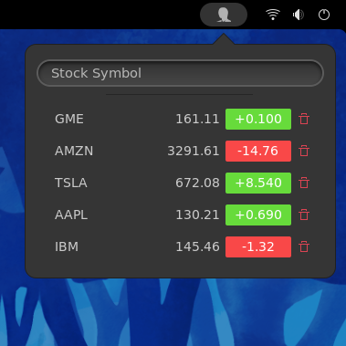

# Stonks!

Stonks is a gnome shell app to track your stocks.
It is inspired by the osx sidebar widget and built on the shoulders of:
- https://github.com/pstadler/ticker.sh/blob/master/ticker.sh
- https://github.com/cinatic/stocks-extension
- https://github.com/nanorepublica/gnome-shell-stock-ticker

## Install
git-clone or Download as zip file, then run make install. 
```
make install
```

Log-out from your account then log back in to let gnome enable the extension.

## Logs
If something goes wrong, you can check the logs with following command.

```
journalctl -f -o cat /usr/bin/gnome-shell
```
You can also enable more logs changing the debug option with dconf command.

## Screenshot


## Usage
- Click on the stock name or price will bring you to the stock info on yahoo finance.
- Click on the price change will toggle current price change or percentage.
